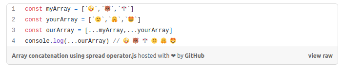
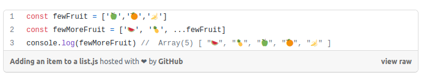
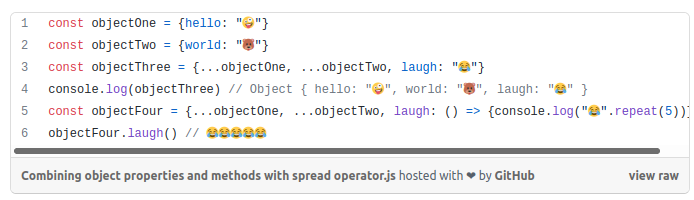

# Passing Functions as Props

## React Docs - lists and keys


1. What does .map() return?

- A new array with each element being the result of the callback function.

2. If I want to loop through an array and display each value in JSX, how do I do that in React?

- there is many ways, we can use forEach, forLoop and map.

in for loop it will be like this:


```let arr = [1,2,3,4,5];```

```for(let i = 0; i < arr.length; i++){```

   ```console.log(arr[i]) ;}```

----

In for Each:

```let arr = [1,2,3,4,5];```

```arr.forEach(element => {```

   ```console.log (element);});```

----

in .Map:

```let arr = [1,2,3,4,5];```

```let array = arr.map((element) => {```

  ``` console.log (element);}); ```

----

3. Each list item needs a unique **Key**.

----

4. What is the purpose of a key?

- React uses keys to figure out which items have changed, been added to, or been removed. To give the elements in the array a stable identity, keys should be assigned to them. A string that uniquely identifies a list item among its siblings is the best approach to choose a key.

---

## The Spread Operator


1. What is the spread operator?

- The spread operator is a convenient and fast way to add items to arrays, combine arrays or objects, and spread an array across a function's arguments.

----

2. List 4 things that the spread operator can do.

- Copying an array
- Using Math functions
- Combining objects
- Combining objects

------

3. Give an example of using the spread operator to combine two arrays.



---------

4. Give an example of using the spread operator to add a new item to an array.



-----

5. Give an example of using the spread operator to combine two objects into one.



------

<!-- ## How to Pass Functions Between Components

[Link to the video Here](https://www.youtube.com/watch?v=c05OL7XbwXU)

1. In the video, what is the first step that the developer does to pass functions between components?

2. In your own words, what does the increment function do?

3. How can you pass a method from a parent component into a child component?
  
4. How does the child component invoke a method that was passed to it from a parent component? -->
